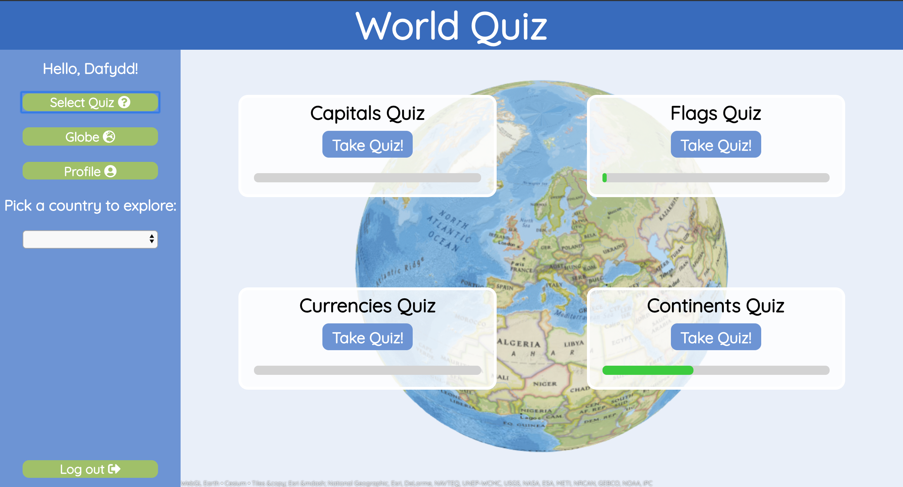
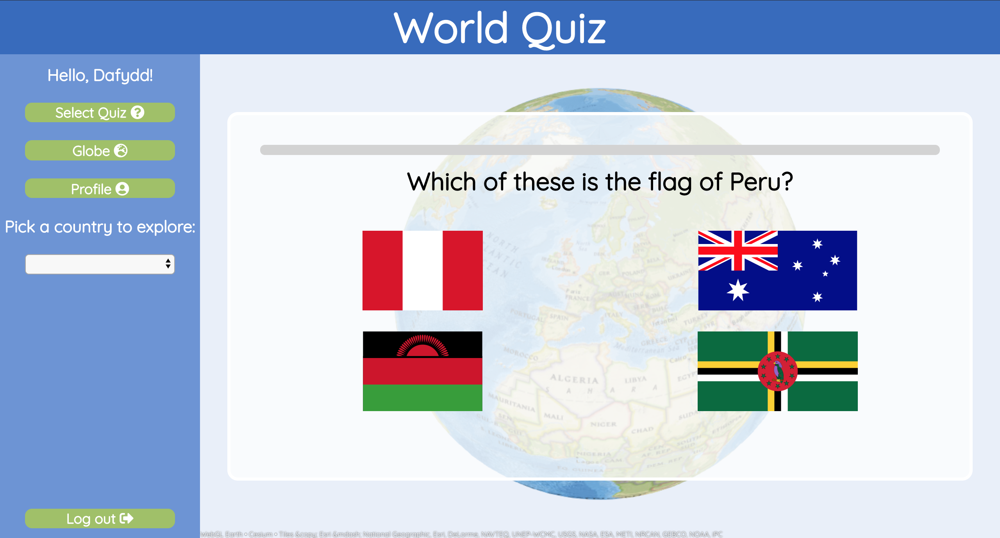
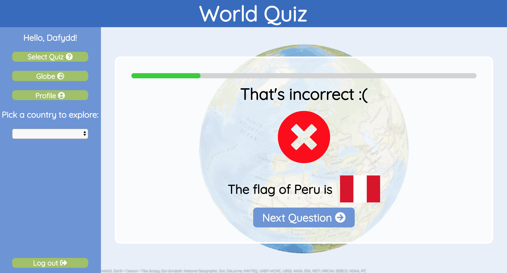
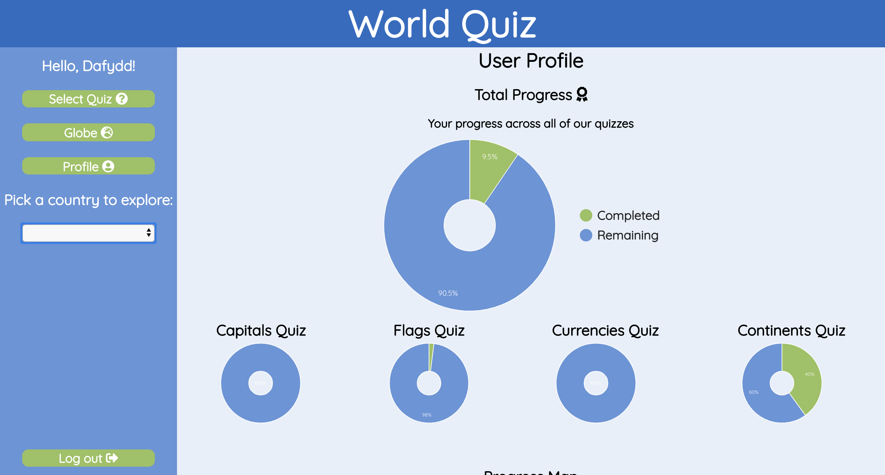
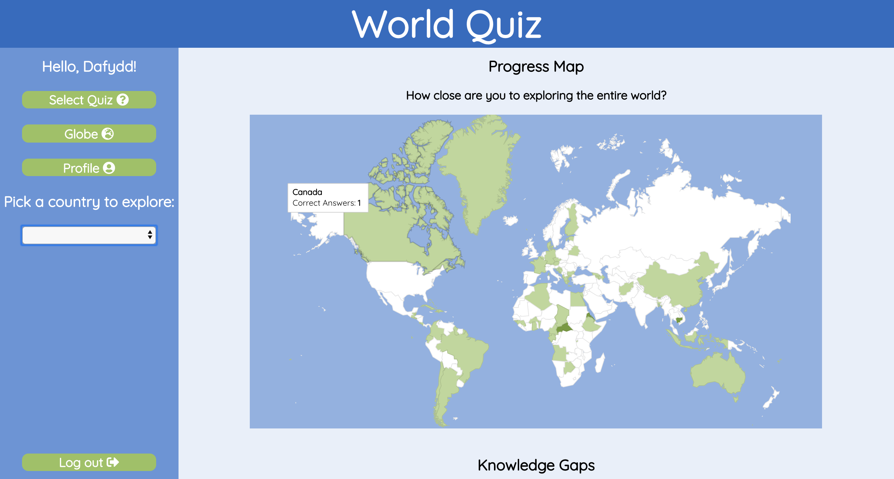
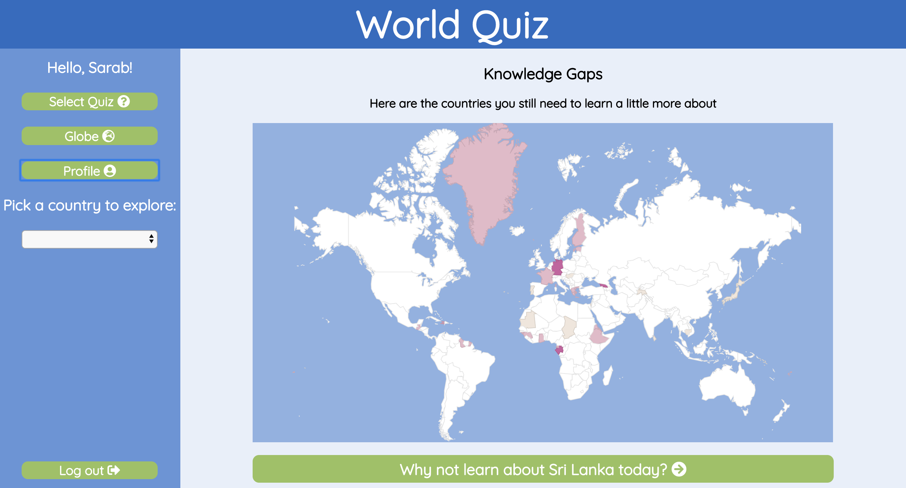

# World Quiz
#### Travel the globe in this interactive and educational quiz game, where learners can improve their knowledge of flags, capitals, currencies and continents.

Group project for CodeClan, build over 7 days with [@laurasheach](https://github.com/laurasheach) and [@sarab78](https://github.com/sarab78) in Week 8 & 9.

A full stack web app with a Vue.js / JavaScript frontend, with an Express.js and MongoDB backend.


## Brief

*The BBC are looking to improve their online offering of educational content by developing some interactive browser applications that display information in a fun and interesting way. Your task is to make an a Minimum Viable Product or prototype to put forward to them - this may only be for a small set of information, and may only showcase some of the features to be included in the final app.*

## Features
* Users can take quizzes on world capitals, currencies, continents and flags

* Fully explorable globe implemented with [WebGL Earth](http://www.webglearth.org/)

* Users can automatically fly around the globe and view information linked to the location through the  [RESTCountries.eu](https://restcountries.eu/) API

* Users can build up a profile to track which countries they know well (and those they don't!)

* Interactive charts build with [Google Charts](https://developers.google.com/chart/) visually display the user's progress and automatically suggest countries they should learn a little more about, based on previously failed questions

* The ability to create a new account, and to to delete your account

* All questions, answers, and quiz topics are built dynamically from the API and are not hardcoded. This means it would be simple to add or remove categories of quiz based on the available API data

## Features I'd like to implement in future -

* Simple user achievements - tracking streaks of correct answers, completion of a continent, number of daily questions are just a few examples.

* An admin page which would allow a teacher to track activity and progress of students

* Login with password and authentication

* CSS Animations - progress bar animation, more visually dynamic quiz answer page, custom map marker

* Fly to random (or incomplete) country

* Make country data in nav bar appear when user clicks globe area of country

## Screenshots

##### Quiz Selection


##### Flags Quiz


##### Answer Page


##### Explore the globe


##### User profile charts


##### User profile progress map


##### User profile knowledge gap map


## Installation

```
cd server
npm i
mongod
npm run seeds
npm run server:dev
```

```
cd ..
cd client
npm i
npm run serve
```

You will need a Google Maps API key to run this project, which will be in the following file -

`client/private/keys.js`

and in the following format -

`export const googleMapsAPIKey = 'your_key'`
